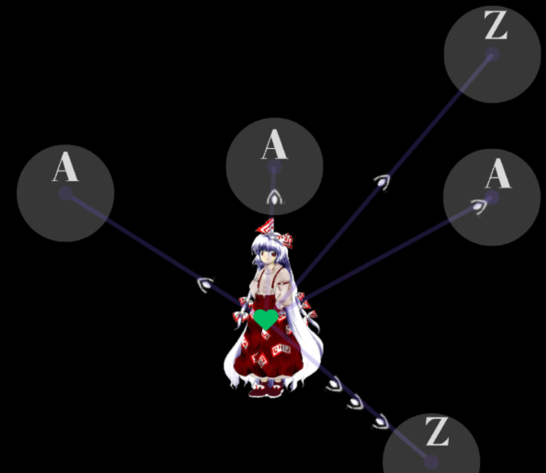
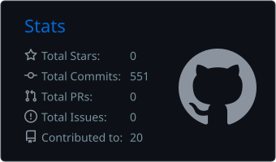
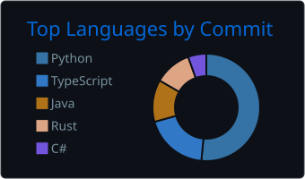

  

  <em>Engineering student, data engineer and MIR researcher, making machines listen to what Chopin has been saying for centuries.</em>

  
  
  

  
Table of contents

  <ol>
    <li><a href="#about-me">About me</a></li>
    <li><a href="#featured-project">Featured project</a></li>
    <li><a href="#research">Research</a></li>
    <li><a href="#tech-stack">Tech stack</a></li>
    <li><a href="#github-stats">GitHub stats</a></li>
    <li><a href="#contact">Contact</a></li>
  </ol>

---

## 🎬 About me 🎬

I'm an **engineering student at [IMT Mines Alès](https://www.imt-mines-ales.fr/)** (Software development), following a work-study programme as a **Data Engineer** in the Business Intelligence service of **Capelle Group**. Day to day that means SQL, ETL pipelines, dashboards, migrations and automation. On the side, I'm a **classical pianist** (Chopin fanclub) who likes to see what happens when music theory meets machine learning.

- 🏃‍➡️ **Runner:** Running two or tree time a week
- 🎹 **Off the keyboard:** classical piano, music theory, composing
- 🐧 **Daily driver:** Ubuntu, Docker, Python and open-source tooling
- 📍 **Location:** Alès, France

---

## 💫 Featured project: [Oshi](https://github.com/diego-carriere/Oshi) 💫

  
  
  

**Oshi** is a **free, open-source 2D rhythm game** inspired by the universe of the *Touhou Project* and by the mechanics of *osu!*. The title comes from *oshi* (推し): the one you support or look after, here it's the Touhou characters. Also in idol culture it means your favourite performer.

  
   
  Concept: projectiles fly towards the lettered circles, and you hit the right key with the mouse on the circle to validate the current beat.

 

**Tech stack:** 

**Status:** 🚧 early development. The rendering foundations (OpenGL renderer, vertex and index buffers, shaders) are in place, and the gameplay described above is the design target.

Unofficial fan project. Touhou Project is the property of ZUN / Team Shanghai Alice.

---

## 🔬 Research 🔬

### Korean research
I'm working on **Music Information Retrieval (MIR)** at the Data Networks Lab of Chungnam National University, under the supervision of Professor Youngseok Lee. The work focuses on **musicology aware lighting-sequence generation** based on **cross-genre analysis**, with an **NIME2027** paper submission as a goal.

- 🎼 Structure extraction from scores and audio
- 🤖 LLM-integration to generate  music-synchronised lighting
- 🔁 Cross-genre comparison and difference of analysis patterns

### French research
I am also working on Hit songs Predicition (HSP) at IMT Mines Alès under the supervision of Sylvain Vauttier. We compare the SOTA of harmonic analysis in HSP with romantic piano complex structure. The objective is to identify an optimal musical architecture in order to better understand the technical, and more specifically, harmonic determinants of a work's popularity.

- 🎼 Large  musical data extraction, labeling and excerpt of features.
- 🤖 Machine learning benchmark to extract harmonic structure popularity
- 🔁 Analysis and compare with SOTA on pop music

---

## 🛠️ Tech stack 🛠️

### 🐍 Languages

### 📊 Data & BI

### 🧰 Tools & platforms

### 🖥️ Dev environment

---

## 📊 GitHub stats 📊

  
  
   
  

---

## 📫 Contact 📫

  
  

---

  
    
  <em>“Same notes, different tempo.”</em>

(<a href="#readme-top">back to top</a>)

